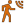

# Home Assistant Motion Detection Add-On

 

[Coverage Status](https://coveralls.io/repos/github/bcpearce/hass-motion-detection-addon/badge.svg?branch=code-coverage)](https://coveralls.io/github/bcpearce/hass-motion-detection-addon?branch=code-coverage)

---

Add-On for Home Assistant that provides motion detection capabilities using various cameras and sensors.

## Features

Add a motion detection sensor to any RTSP video feed to be represented as a motion detection sensor in Home Assistant.

While the software is running, it will continuously analyze the video feed for motion and update the sensor state in Home Assistant.

## Installation

### Add-on

For HassOS or supervised installations, it can be installed as an Add-on.

From the Add-on settings menu, click "..." and add the repository [https://github.com/bcpearce/hass-motion-detection-addon](https://github.com/bcpearce/hass-motion-detection-addon)

When running as an add-on, communication with Home Assistant is done over the supervisor. Simply add the feed video URL and any necessary authentication credentials. The motion-detection Binary Sensor entity will be created upon first update.

### Docker Container

This can be run as a standalone Docker container.

```shell
docker pull bcpearce/hass-motion-detection-addon
docker run -d bcpearce/hass-motion-detection-addon --source-url rtsp://your-camera-url --hass-url http://your-home-assistant-url:8123 --hass-token your-long-lived-access-token --hass-entity-id your-entity-to-update
```

This can also be run as a Docker compose service:

```yaml
services:
  motion-detection:
    image: bcpearce/hass-motion-detection-addon
    network_mode: host
    environment:
      URL: "rtsp://your-camera-url"
      HASS_URL: "https://homeassistant.example.com:8123/"
      HASS_ENTITY: "binary_sensor.your_motion_detector"
      HASS_TOKEN: "your_long_lived_access_token"
      DETECTION_SIZE: "5%"
```

### Bare Metal

It can also be compiled and run standalone. It has been tested on Ubuntu 24.04 and Windows, although running this on Windows is mainly supported only for development purposes.

```shell
./MotionDetection --source-url rtsp://your-camera-url ...
```

## Options

Detection size can be set using the `--detection-size` flag, which can be set as either a percentage of the frame size (e.g., `5%`) or an absolute pixel size (e.g., `500`).

The full configuration options can be found by running the command with `--help`. Or by expanding the options in the add-on configuration settings.

If your RTSP camera feed requires authentication, you can set Basic, Digest, or Bearer authentication using the flags `--source-username` and `--source-password` or `--source-token`. Or by setting the environment variables `USERNAME`, `PASSWORD` and `TOKEN`.

Home Assistant requires a long-lived access token to authenticate with the API. You can create one in your Home Assistant user profile page. Set this token using the `--hass-token` flag or the environment variable `HASS_TOKEN`.

__If possible, use a substream or lower resolution and framerate stream for motion detection__. Faster streams will consume much more resources and will provide minimal benefit. Motion detection can be done well on a lower resolution and at framerates as low as 5-12 FPS.

## HTTP Frontend

A basic frontend is provided by default on port 32834. This frontend shows the current feed image with motion detection regions of interest highlighted, and a visual of the model used for detection.

## Compilation

This project uses CMake to build the project and vcpkg to manage dependencies.

While it is easiest to configure CMake to use vcpkg toolchain, you can also manually install the dependencies and CMake will find them automatically.

Compile the project using CMake:

```shell
mkdir build && cd build
cmake ..
cmake --build .
```

## Tests

This project uses Google Test and CTest. To run the tests, after building the project run `ctest` in the build directory.

Tests are compiled with the flag `-DBUILD_TESTS=ON` in CMake. You can also run the tests directly using `./MotionDetectionTests`.

As the tests spin up simulation servers for mimicking communication with video sources and Home Assistant installs, the tests should not be run in parallel as they may compete for the same socket ports.